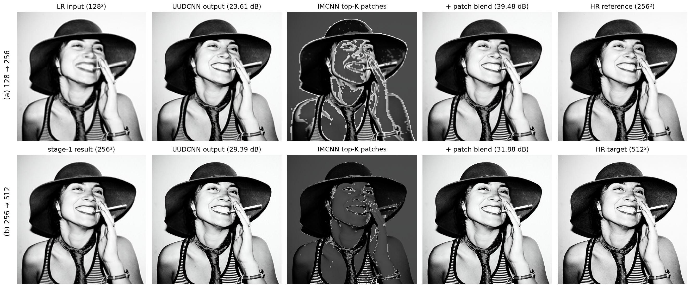

# 실험 기록

메모리가 제한된 UAV가 적은 촬영량으로 고해상도 영상을 얻도록, 복원 모델과 영역 선택
모델을 설계하고 비교한 과정과 결과를 정리한다.

## 1. 문제 설정

- UAV는 한 번에 128²픽셀만 촬영할 수 있다. 높이 날면 전체를 거칠게, 낮게 날면 좁은
  영역을 선명하게 찍는다.
- 목표는 여러 고도의 촬영으로 최종 영상을 복원하는 것이고, 과제는 두 가지다.
  - 다음 촬영에서 어느 영역을 찍을지 고르는 것
  - 해상도가 다른 영상들로 최종 화질을 최대화하는 것

## 2. 파이프라인


1. 가장 높은 고도에서 장면 전체를 128²로 한 번 찍는다.
2. 서버가 이를 CNN으로 2배(256²) 키우고, 패치별 중요도를 예측해 가장 중요한 K개 패치의
   위치를 돌려준다. K는 패치들이 정확히 128² 한 장을 채우도록 `K = 128² / 패치 크기²`로
   정한다.
3. UAV가 내려가 그 영역만 2배 해상도로 찍고, 서버가 키운 영상에 합성한다.

   ```
   reconstructed = upscaled + (hr - upscaled) * mask
   ```

4. 같은 과정을 256² 복원 영상에 한 번 더 반복해 512²를 만든다.

UAV가 찍는 양은 128² 세 장으로, 512² 전체의 약 19%다.

## 3. 복원 모델 설계

| 모델 | 구조 | 설계 이유 |
| --- | --- | --- |
| SRCNN | 보간 후 합성곱 3층 | 기준선 |
| TransConv | 합성곱 → residual block → transposed conv → 합성곱 | SRCNN의 보간을 학습되는 transposed conv로 바꾸고, residual block으로 깊이를 늘렸다. |
| UDUCNN | 업 → 다운 → 업 | 첫 업샘플은 대략적인 구조만 만들고 세부가 부족하다. 중간 다운샘플로 특징을 압축·정제해 노이즈를 줄이고, 다시 업샘플해 정교한 고해상도 영상을 만든다. |
| UUDCNN | 업 → 업 → 다운 | 업샘플을 한 번 더 넣어 receptive field를 넓히고, 더 높은 해상도(4배)에서 특징을 정제한 뒤 2배로 내린다. |

- **residual block을 쓴 이유:** 저해상도 영상에 transposed conv를 바로 적용하면 특징을
  충분히 잡지 못한다. 데이터가 많지 않아 합성곱 층을 그냥 쌓으면 과적합 위험이 커진다.
  residual block은 두 문제를 함께 줄인다.

## 4. 영역 선택 모델 설계

- **IMCNN:** 작은 CNN이 키운 영상에서 픽셀별 중요도 맵을 예측하고, 패치 단위 average
  pooling으로 격자로 줄인다. 학습 때는 격자에 softmax를 적용한 soft 마스크를 쓰고,
  추론 때는 상위 K개 패치만 1인 hard 마스크를 쓴다. 세부가 많은 영역에 예산을 쓰고,
  평평한 배경처럼 정보가 적은 영역은 건너뛰도록 학습된다.
- **MRIMCNN:** 원본, ½, ¼ 해상도에서 각각 중요도 맵을 예측해 합친다. 여러 수준의 세부
  정보를 함께 보기 위한 구조다.
- **학습 방법:** 미리 학습한 업스케일러를 고정하고, soft 마스크로 실제 고해상도 패치를
  섞은 결과와 원본의 MSE를 줄이도록 마스크 모델만 학습한다. 그러면 마스크는 업스케일러의
  오차가 큰 곳에 예산을 쓰게 된다. 두 번째 단계(256² → 512²)의 마스크는 512² 크기에서
  따로 학습한다.

## 5. 실험 조건

- **데이터:** COCO train2017 3,000장으로 학습, val2017 500장으로 평가. 저해상도·고해상도
  쌍은 bicubic 축소로 만든다.
- **학습:** 모든 모델 50에폭, batch 4, Adam(learning rate 1e-3), StepLR, seed 0, MSE 손실.
- **평가:** 평가 이미지 500장의 평균 PSNR. 영역 선택은 hard 상위 K개 마스크로 평가한다.

## 6. 결과: 복원 모델 (128² → 256²)

| 모델 | SRCNN | TransConv | UDUCNN | UUDCNN |
| --- | --- | --- | --- | --- |
| 파라미터 | 56K | 209K | 264K | 376K |
| 평균 PSNR (dB) | 28.21 | 30.78 | 30.99 | **31.10** |

- 보간을 transposed conv로 바꾼 TransConv가 SRCNN보다 2.57dB 높다.
- 업·다운 구조의 UDUCNN, UUDCNN이 TransConv보다 높고, 4배 해상도에서 정제하는
  UUDCNN이 가장 높다.

## 7. 결과: 패치 크기 (UUDCNN 위, 1단계 256²)

같은 촬영 예산(`K = 128² / 패치 크기²`)에서 마스크 패치 크기를 1, 2, 4, 8로 바꿔 비교했다.


| 패치 크기 2 | + 랜덤 선택 | + IMCNN | + MRIMCNN |
| --- | --- | --- | --- |
| 평균 PSNR (dB) | 32.35 | 36.90 | **36.98** |

영역 선택이 없는 UUDCNN은 패치를 쓰지 않아 31.10dB 하나다.

- 두 마스크 모두 패치 크기 2에서 가장 높고, 모든 패치 크기에서 랜덤 선택보다 높다.
- 랜덤 선택은 패치 크기와 상관없이 거의 같다. 예산이 같으면 패치를 얼마나 잘게
  나누는지보다 어디에 쓰는지가 중요하다.
- 패치 크기 2에서 IMCNN은 랜덤 선택보다 4.55dB, 영역 선택이 없는 UUDCNN보다 5.80dB
  높다.

## 8. 결과: 두 단계 복원 (128² → 256² → 512²)

두 단계 모두 마스크를 적용하고, 512² 출력에서 PSNR을 쟀다.

| 파이프라인 | UUDCNN만 두 번 | + 랜덤 선택 | + IMCNN | + MRIMCNN |
| --- | --- | --- | --- | --- |
| 평균 PSNR (dB) | 27.15 | 28.15 | **31.53** | 31.57 |
| 마스크 파라미터 | — | — | **5.5K** | 16.6K |

- 학습된 마스크는 같은 예산을 랜덤으로 쓸 때보다 3.4dB(28.15 → 31.53) 높다.

## 9. 최종 선택: UUDCNN + IMCNN

- **복원:** 네 모델 중 PSNR이 가장 높은 UUDCNN을 쓴다.
- **영역 선택:** IMCNN을 쓴다. MRIMCNN이 두 단계 결과에서 0.04dB 높지만 파라미터가
  약 3배(16.6K 대 5.5K)라서, 파라미터 대비 성능은 IMCNN이 낫다. 의미 있는 차이는 두
  마스크 사이가 아니라 학습된 선택과 랜덤 선택 사이(3.4dB)다.

## 10. 예시 이미지



val2017 이미지 한 장에 UUDCNN + IMCNN을 적용한 단계별 결과다.

- 마스크는 두 단계 모두 얼굴, 모자 경계처럼 세부가 많은 영역에 예산을 쓰고 평평한
  배경은 건너뛴다.
- 1단계는 이 이미지를 23.61dB에서 39.48dB로 올린다.
- 2단계는 같은 예산이 512² 프레임의 6.25%만 덮는데도 2.5dB(29.39 → 31.88)를 더한다.
